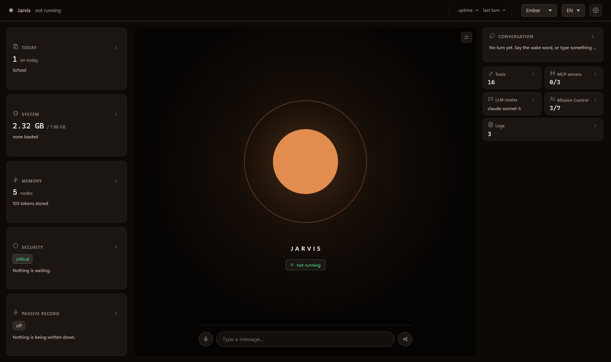

# Jarvis

**A 100% private AI voice assistant that lives on your computer** (works offline). Talk naturally as if Jarvis is a third person in the room — say its name anywhere in your sentence and get conversational, context-aware responses. It remembers everything, always knows the current location and time, can search the web, read your screen, control Chrome, track nutrition, and much more with support for unlimited MCPs and tools without context rot. Sensitive info is automatically redacted before it reaches ordinary conversation memory and model prompts.

🔒 100% local processing. No subscriptions. No data harvesting. Automatic redaction of sensitive info. Free offline dictation included.

---

**Support Jarvis** [](https://github.com/sponsors/isair) [](https://ko-fi.com/isair)

---

<p align="center">
  
</p>

<p align="center">
  
  
  
</p>

## Why Jarvis?

**🔒 Your data stays yours** - 100% local AI processing. No cloud, no subscriptions, no data harvesting. Automatic redaction of sensitive info. This is non-negotiable.

**🗣️ A third person in the room** - Unlike voice assistants that only respond to rigid commands, Jarvis understands conversations. It maintains a short temporary rolling context of what's being discussed, so when you ask "Jarvis, what do you think?" it knows exactly what you're talking about. Have it chime into discussions with friends, help debug code while you talk through problems, or weigh in on decisions.

**🧠 Never forgets** - Unlimited memory across conversations. Adapts tone naturally to the topic. Learns your preferences over time.

**🎙️ Free dictation** - Hold a hotkey, speak, release — your words appear in any app as text. Like WisprFlow, but free, offline, and private. No subscription, no cloud transcription.

**🔌 Extensible** - MCP integration connects Jarvis to thousands of tools: smart home, GitHub, Slack, databases, and more. Smart tool selection means adding more tools won't slow things down.

**📊 Transparent progress** - We track what works (and what doesn't) with automated evals. [See current accuracy →](EVALS.md)

**🚧 Known limitations:** Jarvis is under active development. Primary development happens on macOS. Windows/Linux support may lag behind. We're building in the open, [issues](https://github.com/isair/jarvis/issues) and [contributions](https://github.com/isair/jarvis/pulls) welcome!
- No mobile apps ([#17](https://github.com/isair/jarvis/issues/17))
- "Stop" commands during speech sometimes get filtered as echo ([#24](https://github.com/isair/jarvis/issues/24))
- Dictation is not available on macOS 26+ (Tahoe) due to a pynput incompatibility ([#172](https://github.com/isair/jarvis/issues/172))

<details>
<summary><strong>See it in action</strong> (example conversations)</summary>

**Chiming into conversations** (the magic moment):
```
👤 Alice: I wonder what the weather will be like tomorrow
👤 Bob: Yeah, we should check before planning the picnic
👤 Alice: Jarvis, what do you think?
  📝 Heard: "What do you think Jarvis?"
  🧠 Intent (wake word): directed → "what do you think about the weather for the picnic"

✨ Working on it: what do you think about the weather for the picnic
  🧰 Tool: getWeather…
  💬 Generating response...

🤖 Jarvis
Tomorrow looks great for a picnic! Sunny with highs around 22°C...
```
Jarvis understood the entire conversation and gave a contextual answer — no need to repeat the question.

**Browser automation via MCP:**
```
  📝 Heard: "Open YouTube Jarvis."
  🧠 Intent (wake word): directed → "open YouTube"

✨ Working on it: open YouTube
  💬 Generating response...

🤖 Jarvis
I have opened YouTube for you.
```

**Health-aware advice:**
```
  📝 Heard: "Should I order pizza tonight considering my health goals Jarvis?"
  🧠 Intent (wake word): directed → "should I order pizza tonight considering my health goals"

✨ Working on it: should I order pizza tonight considering my health goals
  🧰 Tool: fetchMeals…
  💬 Generating response...

🤖 Jarvis
Looking at your week — you mentioned wanting to lose 5kg by June...
Today you've had about 860 calories so far. Given your 1,800 calorie target,
you've got room for pizza! But maybe consider thin crust to save calories.
```

**Personalised news search:**
```
  📝 Heard: "What are some news from today that might interest me Jarvis?"
  🧠 Intent (wake word): directed → "what are some news from today that might interest me"

✨ Working on it: what are some news from today that might interest me
  🧰 Tool: searchMemory…
  🧰 Tool: webSearch…
  💬 Generating response...

🤖 Jarvis
Here's a quick snapshot of today's headlines...
```

**Natural wake word placement** (say "Jarvis" anywhere):
```
  📝 Heard: "Give me a random topic to discuss Jarvis."
  🧠 Intent (wake word): directed → "give me a random topic to discuss"

✨ Working on it: give me a random topic to discuss
  💬 Generating response...

🤖 Jarvis
How about the Fermi Paradox? Given the vast number of stars...
```

**Wake acknowledgement** (a standalone wake word collects one request):
```
  📝 Heard: "Jarvis"
👂 Ja, ich bin bereit. Was kann ich für Sie tun?

  📝 Heard: "Open YouTube"
✨ Working on it: open YouTube

🤖 Jarvis
I have opened YouTube for you.
```

</details>

## Quick Install

### 1. Install Prerequisites

| Platform | Requirement |
|----------|-------------|
| **All** | [Ollama](https://ollama.com/download) (default), or any OpenAI-compatible server you already run (LM Studio, Jan, llama.cpp, vLLM, oMLX, LocalAI, …) — see [Configuration → LLM Provider](#configuration) |

### 2. Download Jarvis

Get the latest from [GitHub Releases](https://github.com/isair/jarvis/releases):

| Platform | Download | Run |
|----------|----------|-----|
| **Windows** | `Jarvis-Windows-x64.zip` | Extract → Run `Jarvis.exe` |
| **macOS** | `Jarvis-macOS-arm64.zip` | Extract → Move to Applications → Right-click → Open |
| **Linux** | `Jarvis-Linux-x64.tar.gz` | `tar -xzf` → Run `./Jarvis/Jarvis` |

Jarvis starts listening automatically — just say "Jarvis" and talk!

<p align="center">
  
  
  
  
  
  
</p>

<p align="center">
  
</p>

## Features

- **Conversational Awareness** - Understands ongoing discussions. Ask "Jarvis, what do you think?" and it knows what you're talking about. Works naturally in multi-person conversations.
- **Text Chat** - Type to Jarvis alongside voice. Voice and text share one conversation, so a follow-up typed in the chat window continues a voice discussion. Text never speaks. Open it from the tray menu (`💬 Chat…`) while Jarvis is listening. The window is styled like an SMS thread with a single contact: speech bubbles, timestamps, and an online/typing presence line. It shows a local status banner while Jarvis starts, stops, or needs to be restarted, and every message you send carries a rewind button that rolls the conversation back to that point and regenerates the reply.
- **Unlimited Memory** - Never forgets. Searches across all your conversation history and can add bounded, attributable excerpts from a local Remio knowledge base. Browse and edit Jarvis memory in the Control Centre.
- **Control Centre** - A local web interface the daemon serves at `http://127.0.0.1:5055`: live state, memory, conversation, tools, security, technical readings, and every setting. Offline, no build step, nothing leaves the machine.
- **Passive Capture (opt-in)** - Keep a local, text-only record of speech the recogniser already transcribed, including ambient conversation not addressed to Jarvis. It is off by default, visibly indicated while active, and deletable by line, day, or in full. No audio is written to disk.
- **Adaptive Tone** - Automatically surgical for code, pragmatic for business, encouraging for wellbeing — no manual mode switching
- **Smart Tool Selection** - Embedding-based relevance filtering picks only the tools needed per query — add unlimited MCP tools without performance degradation
- **Built-in Tools** - Screenshot OCR, web search (DuckDuckGo → Brave → Wikipedia fallback chain with auto-fetch), weather, current time in any city or timezone, file access, opening websites, apps and folders on your own machine, opt-in semantic browser interaction through isolated Playwright, opt-in native Windows control through UI Automation, nutrition tracking, location awareness, optional Hermes crew delegation, plus a tool-discovery escape hatch the agent uses to widen its own toolset mid-reply. With the crew channel configured, a local turn that is not close to done at 3 seconds is delegated; close-to-done local work has a 5-second hard cutoff. The crew result arrives later in Mission Control or the shared vault, not inline.
  - `browserInteract` reads and acts through named page controls in a headed, isolated Playwright browser. It is opt-in and confirms each consequential action.
  - `desktopInteract` reads and acts through named UI Automation controls in one already-running Windows application. It is opt-in and confirms each consequential action.
- **Knowledge Graph Memory** - Self-organising memory that learns from conversations, auto-splits by topic, and surfaces relevant knowledge automatically
- **Natural Voice** - Address Jarvis at either end of your sentence, then follow up without repeating the wake word after the reply finishes
- **Starts Talking Sooner** - Jarvis speaks each sentence as it finishes writing it, instead of waiting for the whole answer. Long replies begin about a second earlier; short ones are unchanged, because there is nothing to overlap
- **Conversation Mode** - Turn it on in the Control Centre's Conversation view and the follow-up window stays open: no question needs the wake word until you ask Jarvis to stop. The header says so on every view while it runs.
- **Fast Stop** - Use the tray action `⚡ Stop Now (Skip Diary)` to release local model resources quickly when you need your machine back immediately.
- **Dictation Mode** - Free, offline alternative to WisprFlow — hold a hotkey, speak, release to paste text into any app
- **MCP Integration** - Connect to thousands of external tools (Home Assistant, GitHub, Slack, etc.)

## System Requirements

| Hardware | VRAM | Model |
|----------|------|-------|
| Low-VRAM / CPU | 2GB+ | `qwen3.5:0.8b` |
| Most users | 8GB+ | `gemma4:e2b` (default) |
| Better quality | 16GB+ | `gemma4:e4b` |
| High-end | 24GB+ | `gpt-oss:20b` |

> **Note:** VRAM requirements include the fast model (`gemma4:e2b`) which is always loaded alongside the chat model for voice intent classification and other real-time work. The default chat model shares this, so no extra VRAM is needed.

The setup wizard will guide you through model selection and installation on first launch.

## Configuration

Most users won't need to change anything. Open **⚙️ Settings** from the tray menu to configure Jarvis through a graphical interface — no JSON editing required. Settings are saved to `~/.config/jarvis/config.json`.

<p align="center">
  
  
</p>

<details>
<summary><strong>Passive Capture</strong></summary>

Passive Capture is off by default. When enabled under **📝 Passive Capture**, it preserves text that speech recognition already produced as a readable room transcript. It does not add another microphone stream and never stores audio. The header shows **recording everything** on every Control Centre view while the switch is on.

Transcript text is stored as heard in the local SQLite database. Before ambient lines reach the configured LLM backend, credentials are redacted and the text is fenced as untrusted data. Useful plans, decisions, appointments, and events can be folded into the diary as explicitly overheard information. Addressed speech is not digested again. If `llm_provider` points at a remote server, that server sees the redacted ambient text, so the interface names the configured backend before enabling capture.

The Conversation view can delete one line, one UTC day, or the whole passive record. Whole-record deletion also clears the live rolling buffer. Deleting transcript lines does not remove content already folded into the diary or knowledge graph; those stores have separate delete controls in Memory.

```json
{
  "passive_capture_enabled": false,
  "passive_capture_retention_days": 30,
  "passive_capture_min_words": 3,
  "passive_digest_interval_min": 15,
  "passive_digest_max_lines": 120
}
```

Set retention to `0` to keep transcript lines until manual deletion.

</details>

<details>
<summary><strong>Security confirmations</strong></summary>

Jarvis asks before sensitive tool execution. The default `critical` level protects every MCP tool, meal deletion, and local file writes, appends, or deletion. Set `paranoid` to confirm every tool, or `off` only in a controlled development environment.

Configure the order under **⚙️ Settings → 🔐 Security**. Jarvis skips channels that are not configured or cannot open. A refusal or timeout denies the tool immediately, and no available channel also denies it.

- **Desktop** shows the tool and arguments in a local Qt dialog and needs no credentials.
- **Telegram** sends Approve and Deny buttons to one authorised chat. Create a bot with BotFather, send the bot a message, then configure the bot token and chat ID. You can use the settings window or the `TELEGRAM_BOT_TOKEN` and `TELEGRAM_CHAT_ID` environment variables, and a configured value wins over the environment. This option sends the displayed tool name and arguments to whichever Bot API server `telegram_api_base_url` names, which is Telegram's by default. Telegram publishes the Bot API server as software, so pointing that key at your own instance keeps the traffic on your machine.
- **Voice/console** asks for a random four-digit code. Voice is the weakest option because anyone in the room can hear and repeat the code.

```json
{
  "security_level": "critical",
  "security_confirm_channels": ["desktop", "telegram", "voice"],
  "security_confirmation_timeout_sec": 60,
  "telegram_bot_token": "",
  "telegram_chat_id": "",
  "telegram_api_base_url": "https://api.telegram.org",
  "telegram_chat_enabled": false
}
```

Telegram is optional and remains unavailable until both credentials are set. Jarvis continues to work locally with desktop and voice confirmation when Telegram is not configured.

Setting `telegram_chat_enabled` lets that same chat talk to Jarvis rather than only approve actions: send a message, get a reply, in the same conversation as voice and the chat window. It is off by default because a message runs tools on your machine, which is a larger grant than approving something you already started. Only the configured chat is answered, and messages that arrived while Jarvis was not running are discarded rather than executed at startup.

</details>

<details>
<summary><strong>LLM routes (local or OpenAI-compatible)</strong></summary>

By default Jarvis runs everything locally through [Ollama](https://ollama.com): no API keys, nothing leaves your machine. Optional generic OpenAI-compatible routes can serve the FAST and CHAT lanes. Each configured chain falls back in order and ends at local Ollama.

Diary summaries, topic cleanup, knowledge-graph writes, and embeddings always use loopback Ollama. Cloud-routed memory reads send only the snippets selected for that call. Changing the embedding model or endpoint is deliberately unsupported because it would invalidate the stored vector space.

Pick the provider in the Setup Wizard's first step, or under **⚙️ Settings → 🔌 LLM Provider**. No JSON editing required. On the OpenAI-compatible page the wizard does the legwork for you: it auto-detects running local servers, offers a one-click preset for your app, and when you press **Connect** it loads the server's model list and checks the chosen model for chat, tool calling, and embeddings, so you know it works before you finish setup.

Tested local servers (all run on your own machine):

| App | Default base URL | Notes |
|-----|------------------|-------|
| LM Studio | `http://localhost:1234/v1` | Chat, tool calling, and embeddings. |
| Ollama (OpenAI API) | `http://localhost:11434/v1` | The native Ollama path is the default; the OpenAI shape works too. |
| Jan | `http://localhost:1337/v1` | Chat and tool calling. |
| llama.cpp (`llama-server`) | `http://localhost:8080/v1` | Tool calling depends on the model. |
| LocalAI | `http://localhost:8080/v1` | Feature support depends on the backend model. |
| vLLM | `http://localhost:8000/v1` | Tool calling depends on the model. |
| oMLX (Apple Silicon) | varies | No embeddings endpoint, so memory uses keyword search unless you route embeddings to Ollama (below). |

The control centre's **LLM routes** view shows active routes, cooldowns, failures, and masked keys. It performs no outbound request until you press **Probe models**. A route entry has this shape:

```json
{
  "llm_routes": [
    {
      "name": "my-chat-endpoint",
      "provider": "openai_compatible",
      "base_url": "http://localhost:1234/v1",
      "api_key": "",
      "api_key_env": "PROVIDER_API_KEY",
      "model": "your-served-model-name",
      "tier": "chat",
      "timeout_sec": 4.0,
      "enabled": true,
      "capabilities": ["chat", "stream", "tools"]
    }
  ]
}
```

- `tier` is `fast` for short classification work or `chat` for replies and planning.
- `api_key_env` keeps the credential outside the config; its value is resolved only when the route is used. `api_key` remains available for migrated configurations.
- `timeout_sec` is a per-route limit. Streaming also shares one request deadline across attempts. A local route gets 1.2 seconds to start; if it stays silent, the remaining tier chain continues. The first route to emit text owns the answer, so late local output cannot duplicate a cloud reply.
- HTTP rate limits and quota resets are persisted in `~/.jarvis/llm_routes_state.json`, so restarting does not immediately retry a blocked key.
- HTTP 401 and 403 responses remove the key for the process lifetime.

To inspect current catalogues and import FCC credentials once:

```bash
python -m jarvis.llm.probe
python scripts/import_fcc_keys.py
```

Neither command prints a credential. The importer writes only routes whose endpoint advertises a model during that run. Config and route-state files are restricted to the current user where POSIX permissions are available.

</details>

<details>
<summary><strong>Power and Startup</strong></summary>

Jarvis favours fast first responses by default: it warms Whisper, the chat
model, and the intent judge before announcing that it is listening. On Macs or
laptops where heat and battery matter more than instant first-token latency,
enable **⚙️ Settings → ✨ Features → Low Power Mode**.

```json
{
  "low_power_mode": true
}
```

Low Power Mode skips LLM startup warmup and shortens Ollama model residency for
the intent judge from 30 minutes to 1 minute. Whisper still warms so voice input
is ready. The first LLM-backed request after startup or idle may be slower.

</details>

<details>
<summary><strong>Speech Recognition (Whisper)</strong></summary>

#### Language Modes
- **Multilingual** (default, 99 languages): `"whisper_model": "medium"`
- **English Only** (slightly better English accuracy): `"whisper_model": "medium.en"`

#### Model Sizes
| Model | English | Multilingual | Download | VRAM | Speed |
|-------|---------|--------------|----------|------|-------|
| Tiny | `tiny.en` | `tiny` | ~75 MB | ~1 GB | ~10x |
| Base | `base.en` | `base` | ~140 MB | ~1 GB | ~7x |
| Small | `small.en` | `small` | ~465 MB | ~2 GB | ~4x |
| **Medium** | `medium.en` | `medium` | ~1.5 GB | ~5 GB | ~2x |
| Large V3 Turbo | - | `large-v3-turbo` | ~1.5 GB | ~6 GB | ~8x |

Speed is relative to the original large model. [Source](https://github.com/openai/whisper)

`whisper_model` also accepts a Hugging Face repo ID (`"deepdml/faster-whisper-large-v3-turbo-ct2"`) or a directory holding a converted model, which is how you run a model this table does not name.

#### GPU Acceleration (Windows)
If you have an NVIDIA GPU, Jarvis can use CUDA for much faster speech recognition. The Windows installer offers an optional CUDA download during setup. For development:
```bash
pip install nvidia-cublas-cu12 nvidia-cudnn-cu12
```
CUDA is detected automatically — no configuration needed.

#### Spoken Language
- `"whisper_language": ""` — the ISO-639-1 code of the language you speak, e.g. `de` or `ja`. Left empty, Whisper identifies the language on every utterance. Naming it skips that pass (noticeably faster) and stops Whisper from wandering into another language on noisy input. Words you borrow from other languages still transcribe correctly. The setting covers dictation too.

#### Hallucination Filters
Whisper sometimes produces confident but false transcriptions during silence or background noise (e.g. news-show intros, music). These filter them out before they reach the intent judge:

- `"whisper_vad": true` — runs Whisper's own voice-activity detection and discards non-speech audio before decoding. This is the only filter that catches the stock phrase Whisper invents from room noise, because that transcript looks confident by every other measure. Turn it off only if short interjections are being swallowed.
- `"whisper_min_confidence": 0.3` — drops segments whose `avg_logprob`-derived confidence falls below this value. Raise if you see low-confidence noise leaking through; lower if real speech is being dropped.
- `"whisper_no_speech_threshold": 0.5` — drops any segment whose `no_speech_prob` is at or above this value, regardless of `avg_logprob`. Catches the case where Whisper is confident about a hallucinated phrase but its own no-speech signal says the audio was silent. Applies to both the faster-whisper and MLX backends.
- `"whisper_min_language_probability": 0.0` — drops an utterance when Whisper is unsure which language it heard, which is how noise hallucinations tend to look. `0.85` is a workable setting. Has no effect when `whisper_language` is set, since a named language is reported as certain by definition.

All of these are exposed in the Settings window under *Whisper*.

</details>

<details>
<summary><strong>Voice Interface (Advanced)</strong></summary>

**LLM Intent Judge** - Jarvis uses a small LLM for contextual voice intent classification and query extraction. An assistant name at the first or last spoken token takes a deterministic fast path; interior mentions and wake-word-free follow-ups use the judge. On the default Ollama setup this is `gemma4:e2b`, installed automatically alongside your chosen chat model during setup. On an OpenAI-compatible provider the judge uses your served chat model instead, so there is nothing extra to install. The intent judge cannot be disabled but gracefully falls back to simpler text matching if the LLM server is unavailable.

**Tool Router** - When `"tool_selection_strategy": "llm"` (the default), Jarvis asks the fast model to pick which tools are relevant for each query, shrinking the tool catalogue the chat model sees. It's already warm and small enough not to stall the turn. Other strategies: `"keyword"` (fast, no LLM), `"embedding"` (nomic-embed-text), `"all"` (no filtering).

**Task-list Planner** - Before the agentic loop, Jarvis runs a short planning pass that decomposes multi-step queries into an ordered list of sub-tasks. For small models (`gemma4:e2b` class), each planned step is directly resolved to a concrete tool call without relying on the chat model to re-plan turn-by-turn. This significantly improves multi-step reliability. Config options:

```json
{
  "planner_enabled": true,          // set to false to disable the planner entirely
  "planner_timeout_sec": 6.0        // per-call timeout for plan and step-resolver LLM calls
}
```

</details>

<details>
<summary><strong>Small-Model Digest Passes (Advanced)</strong></summary>

Small chat models (~2B, e.g. `gemma4:e2b`) degrade sharply as their prompt grows. Jarvis runs two cheap distil passes to keep the prompt tight:

- **Memory digest** — boils diary + graph recall into a short relevance-filtered note before injecting it as background context.
- **Tool-result digest** — boils a raw tool payload (especially webSearch UNTRUSTED WEB EXTRACT blocks) into a short attributed fact note before it reaches the main reply model.

Both digest passes auto-enable for small models (≤7B) and stay off for large models. For small models, tool-result digest also prevents large fetch_web_page payloads from blowing the context window. Override in `~/.config/jarvis/config.json`:

```json
{
  "memory_digest_enabled": null,          // null = auto-on for SMALL, false to force off, true to force on
  "tool_result_digest_enabled": null,     // null = auto-on for SMALL, false to force off, true to force on
  "llm_digest_timeout_sec": 8.0           // tight ceiling shared by both passes
}
```

Field logs show `🧩 Memory digest: …` and `🧩 Tool digest: …` lines when a pass ran, so you can see when the substrate was replaced.

</details>

## Dictation Mode — Free WisprFlow Alternative

Hold a hotkey to record speech, release to paste the transcription into any app. Works everywhere — your editor, browser, chat, terminal. Completely local, completely free.

<p align="center">
  
  
</p>

| Platform | Default hotkey |
|----------|---------------|
| **Windows** | Ctrl + Win |
| **macOS** | Ctrl + Option |
| **Linux** | Ctrl + Alt |

- 🔒 **100% offline** — your speech never leaves your machine (unlike cloud dictation services)
- 🧠 **Shared Whisper model** — uses the same speech recognition as voice input, no extra memory
- ⚡ **Zero latency startup** — no server round-trip, transcription starts the moment you release
- 📋 **Universal paste** — works in any app that accepts `Ctrl+V` / `Cmd+V`
- 🔇 **Non-intrusive** — main voice listener pauses automatically during dictation
- ✋ **Hands-free mode** — double-tap the hotkey to keep recording without holding; press again or hit Escape to stop
- 🧹 **Filler word removal** — optional LLM-powered cleanup removes "um", "uh", "like", "you know" while preserving meaning
- 📖 **Custom dictionary** — define `"wrong -> right"` replacements for jargon, names, and technical terms
- 📜 **History window** — browse, copy, or delete past dictations from the system tray
- 🎛️ **Easy setup** — configure dictation during the setup wizard or anytime in Settings (hotkey dropdown, filler removal toggle, custom dictionary editor)

Customise the hotkey in Settings or `config.json`:
```json
{
  "dictation_hotkey": "ctrl+alt",
  "dictation_filler_removal": true,
  "dictation_custom_dictionary": [
    "jarvis -> Jarvis",
    "pytorch -> PyTorch"
  ]
}
```

> **Note:** macOS requires Accessibility permissions for the global hotkey. Linux requires X11 (limited Wayland support).

<details>
<summary><strong>Text-to-Speech</strong></summary>

**Piper TTS (default)** - Neural TTS that auto-downloads on first use (~60MB):
- Works out of the box - no setup required
- High-quality British English male voice (en_GB-alan-medium)
- Fast local synthesis with exact duration tracking

To use different Piper voices, download from [HuggingFace](https://huggingface.co/rhasspy/piper-voices) and set:
```json
{
  "tts_piper_model_path": "~/.local/share/jarvis/models/piper/en_GB-alan-medium.onnx"
}
```

**Chatterbox** - AI voice with emotion control (requires running from source):
```json
{ "tts_engine": "chatterbox" }
```

Voice cloning with Chatterbox - add a 3-10 second .wav sample:
```json
{
  "tts_engine": "chatterbox",
  "tts_chatterbox_audio_prompt": "/path/to/voice.wav"
}
```

</details>

<details>
<summary><strong>Location Detection</strong></summary>

Jarvis can provide location-aware responses (weather, local time, etc.) using a local GeoLite2 database — no cloud geolocation services are used.

**IP detection chain** (in order of preference):
1. **Manual IP** — configure `location_ip_address` in settings
2. **UPnP** — queries your local router (no traffic leaves LAN)
3. **Socket heuristic** — determines which interface routes externally (no data sent)
4. **OpenDNS DNS query** — single `myip.opendns.com` lookup to `208.67.222.222` (only external query)

If your ISP uses carrier-grade NAT (CGNAT), Jarvis automatically resolves your true public IP via the same OpenDNS DNS query. This can be disabled:

```json
{
  "location_cgnat_resolve_public_ip": false
}
```

**Setup:** Register for a free [MaxMind GeoLite2](https://www.maxmind.com/en/geolite2/signup) account, download the City database (MMDB format), and save it to `~/.local/share/jarvis/geoip/GeoLite2-City.mmdb`. The setup wizard will guide you through this.

</details>

<details>
<summary><strong>MCP Tool Integration</strong></summary>

Connect Jarvis to external tools via [MCP servers](https://github.com/topics/mcp-server):

```json
{
  "mcps": {
    "github": {
      "command": "npx",
      "args": ["-y", "@modelcontextprotocol/server-github"],
      "env": { "GITHUB_TOKEN": "your-token" }
    }
  }
}
```

**Popular integrations:**
- **Home Assistant** - Voice control for smart home
- **Google Workspace** - Gmail, Calendar, Drive, Docs
- **GitHub** - Issues, PRs, workflows
- **Notion** - Knowledge management
- **Slack/Discord** - Team communication
- **Databases** - MySQL, PostgreSQL, MongoDB
- **Composio** - 500+ apps in one integration

See [full MCP setup guide](#mcp-integrations) below.

</details>

## MCP Integrations

> **Session persistence:** each MCP server is launched once and its stdio session is kept open across tool calls. Stateful servers (e.g. browser automation, where the server owns a long-running Chrome process) work correctly. If you have a server you'd rather not keep resident, set `"idle_timeout_sec": 300` on its config entry and Jarvis will free it after that long without activity. If a server's tools legitimately run long (e.g. delegating a task to an external CLI agent), set `"timeout_sec": 600` to raise its 120-second default call timeout.

<details>
<summary><strong>Home Assistant</strong> - Smart home voice control</summary>

1. Add MCP Server integration in Home Assistant (Settings → Devices & services)
2. Expose entities you want to control (Settings → Voice assistants → Exposed entities)
3. Create Long-lived Access Token (Profile → Security → Create token)
4. Install proxy: `uv tool install git+https://github.com/sparfenyuk/mcp-proxy`
5. Add to config:
```json
{
  "mcps": {
    "home_assistant": {
      "command": "mcp-proxy",
      "args": ["http://localhost:8123/mcp_server/sse"],
      "env": { "API_ACCESS_TOKEN": "YOUR_TOKEN" }
    }
  }
}
```

"Jarvis, turn on the living room lights" / "set bedroom to 72°" / "run good night scene"

</details>

<details>
<summary><strong>Google Workspace</strong> - Gmail, Calendar, Drive, Docs, Sheets</summary>

```json
{
  "mcps": {
    "google_workspace": {
      "command": "npx",
      "args": ["-y", "google-workspace-mcp"],
      "env": {
        "GOOGLE_CLIENT_ID": "your-client-id",
        "GOOGLE_CLIENT_SECRET": "your-client-secret"
      }
    }
  }
}
```
Setup: [taylorwilsdon/google_workspace_mcp](https://github.com/taylorwilsdon/google_workspace_mcp)

</details>

<details>
<summary><strong>GitHub</strong> - Repos, issues, PRs, workflows</summary>

```json
{
  "mcps": {
    "github": {
      "command": "npx",
      "args": ["-y", "@modelcontextprotocol/server-github"],
      "env": { "GITHUB_TOKEN": "your-token" }
    }
  }
}
```

</details>

<details>
<summary><strong>Notion, Slack, Discord, Databases</strong></summary>

**Notion:**
```json
{ "mcps": { "notion": { "command": "npx", "args": ["-y", "@makenotion/mcp-server-notion"], "env": { "NOTION_API_KEY": "your-token" } } } }
```

**Slack:**
```json
{ "mcps": { "slack": { "command": "npx", "args": ["-y", "slack-mcp-server"], "env": { "SLACK_BOT_TOKEN": "xoxb-...", "SLACK_USER_TOKEN": "xoxp-..." } } } }
```

**Discord:**
```json
{ "mcps": { "discord": { "command": "npx", "args": ["-y", "discord-mcp-server"], "env": { "DISCORD_BOT_TOKEN": "your-token" } } } }
```

**Databases:** [bytebase/dbhub](https://github.com/bytebase/dbhub) (SQL), [mongodb-mcp-server](https://github.com/mongodb-js/mongodb-mcp-server) (MongoDB)

</details>

<details>
<summary><strong>Composio</strong> - 500+ apps in one integration</summary>

```json
{
  "mcps": {
    "composio": {
      "command": "npx",
      "args": ["-y", "@composiohq/rube"],
      "env": { "COMPOSIO_API_KEY": "your-key" }
    }
  }
}
```
Get API key at [composio.dev](https://composio.dev)

</details>

## Troubleshooting

<details>
<summary><strong>Common issues</strong></summary>

**First startup takes a bit** - Jarvis pre-warms the Whisper, chat, and intent-judge models before announcing "Listening!" so the first engagement feels instant. This adds a few seconds on cold start and is bounded at 60 s. If Ollama is slow, Jarvis will start listening anyway and load the models on demand. Enable **Low Power Mode** in Settings to skip LLM startup warmup.

**Jarvis doesn't hear me** - Check microphone permissions, speak clearly after "Jarvis"

**Not sure what is running** - Open the tray menu and click **🩺 Runtime Status**. It shows whether Jarvis is listening, whether Low Power Mode is active, whether Ollama is needed/running, which models are configured, and how many MCP servers are enabled.

**Responses are slow** - Ensure you have enough VRAM (8GB+ for default model; see System Requirements for other models)

**Mac gets warm while Jarvis is active** - Enable **⚙️ Settings → ✨ Features → Low Power Mode**. This keeps voice recognition ready while avoiding background LLM warmup and shortening Ollama's idle residency window.

**Mac is still warm after quitting** - If Jarvis starts Ollama for you, quitting Jarvis also stops that owned Ollama runtime. If Ollama was already running before Jarvis opened, Jarvis leaves it running so it does not interrupt your other local AI tools.

**Windows: App won't start** - Extract full zip first, check Windows Defender

**macOS: "App can't be opened"** - Right-click → Open, or System Settings → Privacy & Security → Allow

**Linux: No tray icon** - `sudo apt install libayatana-appindicator3-1`

**Jarvis keeps deflecting on questions it answered before** - small models can record their own past failures into the diary, which then primes future sessions to repeat them. New writes are scrubbed automatically; to clean stored entries, open the control centre's **Memory** view and choose **Clean deflection narration** in the **Maintenance** section. Only sentences that narrate the assistant's failures are removed; the rest of each entry stays.

</details>

## For Developers

<details>
<summary><strong>Running from source</strong></summary>

```bash
git clone https://github.com/isair/jarvis.git
cd jarvis

# macOS
bash scripts/run_macos.sh

# Windows (with Micromamba)
pwsh -ExecutionPolicy Bypass -File scripts\run_windows.ps1

# Linux
bash scripts/run_linux.sh
```

Running from source enables Chatterbox TTS (AI voice with emotion/cloning). Piper TTS works in both bundled and source modes.

</details>

<details>
<summary><strong>Privacy hardening</strong> (stay 100% offline)</summary>

```json
{
  "web_search_enabled": false,
  "wikipedia_fallback_enabled": false,
  "brave_search_api_key": "",
  "mcps": {},
  "location_auto_detect": false,
  "location_cgnat_resolve_public_ip": false,
  "location_enabled": false,
  "passive_capture_enabled": false
}
```

Verify: `sudo lsof -i -n -P | grep jarvis` (should only show 127.0.0.1 to Ollama)

</details>

<details>
<summary><strong>Web search fallback chain</strong></summary>

When DuckDuckGo is rate-limited or returns nothing fetchable, Jarvis walks
a small fallback chain before giving up rather than confabulating:

1. **Brave Search** — opt-in, requires `brave_search_api_key`. Free tier:
   2,000 queries/month. Get a key at
   [api.search.brave.com](https://api.search.brave.com/app/keys).
2. **Wikipedia** — zero-config, on by default, uses the Wikipedia host
   matching the language Whisper auto-detected on the utterance (so a
   Turkish question gets a Turkish answer). Disable with
   `wikipedia_fallback_enabled: false`.
3. **Honest failure** — if every provider fails, the reply tells you the
   search was blocked rather than making something up.

The whole chain is bounded by a ~20s wall-clock deadline so a stalled
provider can't run out the voice-assistant latency budget.

</details>

## Privacy & Storage

- **100% offline** - No cloud services required
- **Auto-redaction** - Emails, tokens, passwords automatically removed
- **Local storage** - Everything in `~/.local/share/jarvis`
- **Passive transcript privacy** - Off by default; text is stored as heard, audio is never stored, and ambient model input is redacted and fenced

## License

- **Personal use**: Free forever
- **Commercial use**: [Contact us](mailto:baris@writeme.com)

## Support

[Report issues](https://github.com/isair/jarvis/issues) · [Discussions](https://github.com/isair/jarvis/discussions) · [Sponsor](https://github.com/sponsors/isair)
