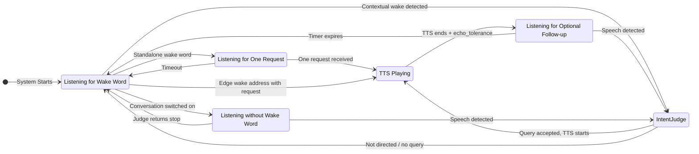

# Listening Flow Specification v2

This document outlines the voice listening architecture. The system uses a **transcript-first** approach where VAD-complete microphone utterances are transcribed and routed from their text. Microphone capture is suspended while Jarvis speaks.

## Architecture Overview

```
┌─────────────────────────────────────────────────────────────────┐
│                         Audio Stream                            │
└───────────────────────────┬─────────────────────────────────────┘
                            │
            ┌───────────────┼───────────────┐
            ▼               ▼               ▼
┌───────────────┐                  ┌───────────────┐
│     VAD       │                  │   TTS Output  │
│ (speech gate) │                  │   Tracking    │
└───────┬───────┘                  └───────────────┘
        │
        ▼
┌───────────────┐
│    Whisper    │
│ (transcribe)  │
└───────┬───────┘
        │
        ▼
┌───────────────────────────────────────┐
│     Rolling Transcript Buffer         │
│     (2 minutes, with timestamps)      │
│                                       │
│  Segments include:                    │
│  - text, start_time, end_time         │
│  - energy level                       │
│  - energy level                       │
└───────────────────┬───────────────────┘
                    │
                    ▼ (on wake detection)
┌───────────────────────────────────────┐
│          Intent Judge LLM             │
│        (gemma4 or main)          │
│                                       │
│  Inputs:                              │
│  - Transcript buffer (recent)         │
│  - Wake word timestamp (if any)       │
│  - Last TTS text + finish time        │
│  - Current state                      │
│                                       │
│  Outputs:                             │
│  - directed: bool                     │
│  - query: "extracted clean query"     │
│  - stop: bool                         │
│  - confidence: high/medium/low        │
│  - reasoning: "brief explanation"     │
└───────────────────┬───────────────────┘
                    │
                    ▼
┌───────────────────────────────────────┐
│           Reply Engine                │
└───────────────────────────────────────┘
```

## Key Design Principles

### 0. Serialised PortAudio Lifecycle

All stream lifecycle calls (`InputStream`/`OutputStream` construction,
`start`/`stop`/`close`/`abort`) run under the process-wide
`jarvis.utils.audio_lock.portaudio_lock`, shared with the dictation engine,
TTS, and the thinking tune. PortAudio documents stream open/close as not
thread safe; unserialised calls across threads abort the whole app on
Windows (#462, #401, #422). The run loop uses `_serialised_stream` instead
of the raw `with stream:` context manager. Two deliberate exceptions: the
Windows mic-permission probe opens its stream *without* the lock (that open
can hang indefinitely when Windows blocks mic access, and hanging while
holding the process-wide lock would freeze every audio user), and its
timeout path abandons a blocked stream instead of aborting/closing it from
another thread — the check thread may still be inside `start()`/`stop()`
on it, and a cross-thread close is a native use-after-free.

### 1. Transcript-First

Instead of extracting post-wake-word audio, we:
- Transcribe each VAD-complete microphone utterance outside playback
- Store transcripts with timestamps in a rolling buffer
- Let the intent judge extract the relevant query

**Benefits:**
- Pre-wake-word chatter naturally filtered: "blah blah Jarvis what time is it" → "what time is it"
- Full context available for intent understanding
- Echo detection via multi-layer approach (fuzzy text matching + LLM intent judge)

### 2. Text-Based Wake Detection

Wake word detection operates on the rolling transcript buffer. When Whisper produces text, it is checked for the configured wake word and aliases using fuzzy matching (`rapidfuzz`). This supports arbitrary wake words in any language.

### 3. Context-Aware Intent Judge

The intent judge receives full context and makes intelligent decisions:
- Knows what TTS said → can identify echo vs real speech
- Sees pre-wake-word context → can understand "...what do YOU think, Jarvis?"
- Extracts clean query → removes filler words, false starts

**Gating:** The judge is called only when there is a contextual engagement signal: a wake name occurs away from an utterance edge, or the utterance falls inside a pending or active hot window. A wake name at the first or last token is an unambiguous address and dispatches directly after Whisper, without an intent-judge call. Pure ambient speech and playback both skip the judge.

**Alias normalisation:** Before the transcript is sent to the judge, every configured wake-word alias in each segment is replaced with the primary assistant name (case-insensitive, word-boundary-aware). Aliases are Whisper mishearings of the wake word (e.g. "Jervis", "Jaivis" for "Jarvis"); without this step the small judge model sees the alias, doesn't know it refers to the assistant, and can decide the user is addressing a different person. Normalisation happens at prompt-build time only — the raw transcript buffer is untouched.

**Wake-word removal in the extracted query:** The wake word is addressed TO the assistant, never part of the query content. The judge prompt explicitly instructs removing every occurrence of the wake word from the extracted `query` — at the start, end, or middle of the sentence, including when it sits next to a named entity (e.g. "movie called Possessor Jarvis" → film is "Possessor", not "Possessor Jarvis"). The only exception is when the user is literally talking *about* the assistant as a subject ("tell me about Jarvis"). This is enforced by prompt rule + example rather than post-hoc string stripping, because the LLM already understands the semantic distinction and can handle cases a regex would mishandle (e.g. proper names that contain the wake word, like "Jarvis Cocker").

**Model residency (`keep_alive`):** Each intent-judge request asks Ollama to keep the model resident after the call. The default duration is 30 minutes, which avoids cold reloads between utterances. When `cfg.low_power_mode` is true, the duration is 1 minute so the model can unload soon after an active exchange. The trade-off is latency: low-power sessions can pay a cold-load cost after idle periods, while default sessions keep the judge model (default `gemma4:e2b`, ~2 GB) in RAM/VRAM during active voice use.

## Startup & Model Warmup

Before the listener announces "Listening!", it pre-loads every model the first engagement will need. All warmup output is grouped under a single `🔥 Warming up models...` header with indented child status lines, e.g.

```
  🔥 Warming up models...
     🎤 Whisper 'small' loaded on cpu
     💬 Chat model 'llama3.1' ready
     🧠 Intent judge 'gemma4:e2b' ready
🎙️  Listening! Try:
      "How's the weather, Jarvis?"          ← when location is known
      "How's the weather in [your city], Jarvis?"  ← when location is disabled or not configured
      "I just ate a Big Mac, Jarvis."
      "What are you thinking, Jarvis?"
      "What do you know about me, Jarvis?"
```

The weather example adapts to location availability: if `location_enabled` is true, a location source is configured (`location_auto_detect` or a manual `location_ip_address`), **and** the GeoLite2 database is present (`is_location_available()` returns true), the plain form is shown; otherwise the `[your city]` placeholder form is shown so the user understands they must substitute a real city name in their query.

On small models, a caveat line is appended above a more involved example to set expectations (`⚠️ Small model in use (…). Assume it can't infer — spell out the steps for anything more involved:`). The Chrome MCP tip continues to appear as its own block when the browser tool is detected.

**What gets warmed:**
- **Whisper** — loading the model; additionally a silent-audio transcribe so the first real utterance doesn't pay the cold-decode cost. Both the MLX and faster-whisper backends do this.
- **Chat model** (`cfg.llm_chat_model`) — verifies reachability and keeps the weights resident with the power-mode `keep_alive` (`30m` normally, `1m` in low-power mode), then sends the query-independent reply-system prefix with a one-token cap. The second request prefills the backend's prompt cache so the first real turn reuses the persona and model-size guidance.
- **Intent judge model** (the fast tier: `resolve_model(cfg, Tier.FAST)`) — same pattern. If it points at the same Ollama model as the chat model, a single warmup covers both roles (Ollama loads the weights once).
- **Embedding model and static tool catalogue** — embeds every builtin and cached MCP tool description into a bounded process cache. Live turns embed only the changing query. Failures remain best-effort and fall open through tool selection.

**Low-power mode:** When `cfg.low_power_mode` is true, the listener skips chat and intent-judge warmup threads and prints `🌱 Low power mode: LLM warmup skipped`. Whisper still warms because speech recognition needs to be ready before the listener can accept input. The first LLM-backed engagement after startup or idle loads models on demand.

**Concurrency:** LLM warmups run in daemon threads started before Whisper loads, so they overlap with Whisper initialisation. After Whisper finishes, the listener joins the warmup threads with a **single 60 s budget** shared across them all. If the budget is exhausted, the listener continues (with a `⏳ Some models still warming — continuing anyway` notice) and the first engagement pays the cold-load cost on demand.

**Best-effort semantics:** Every warmup path swallows its own errors and returns a bool. A failed warmup prints `⚠️ … warmup failed — will load on first use` but never blocks or crashes the listener — voice input is prioritised over startup latency.

## The Listening Modes

### 1. Wake Word Mode (Default)

System is waiting for wake word activation.

**Triggers:**
- Text-based detection finds wake word (or aliases) in transcript

**On trigger:**
1. Start thinking beep immediately and set face state to LISTENING
2. Wait for utterance to complete (user finishes speaking)
3. Whisper transcribes after `endpoint_silence_ms` of silence. The faster-whisper path biases each real utterance with the configured wake word and the product term `Vault` as decoding hotwords; this improves short-name recognition without rewriting accepted transcript text.
4. A configured wake name with request content at the first or last token dispatches immediately
5. A standalone configured wake name speaks the configured acknowledgement and opens one request capture
6. An interior wake name goes to the intent judge and dispatches only an accepted query

The VAD endpoint is the only post-speech waiting window. A completed transcript is never held for an additional collection timer.

### 2. One-request Capture

A standalone wake word opens a bounded capture for one wake-word-free request.

**Activation:** The transcript contains only the configured wake word or one of
its aliases. Jarvis speaks `wake_acknowledgement`, then waits up to
`wake_command_timeout_seconds` for one completed utterance.

**Behaviour:** The capture accepts one non-echo utterance through the same
intent path as a follow-up. Dispatching that utterance closes the capture and
returns to wake-word listening before Jarvis speaks its response.

**Continuous conversation:** The intent judge can identify a request to keep
listening in any language. It opens conversation mode and Jarvis speaks
`conversation_mode_acknowledgement`.

### 3. Hot Window Mode

After TTS finishes, allow wake-word-free follow-up.

**Activation:** `echo_tolerance` seconds after TTS ends (allows echo to settle)

**Duration:** Configurable (default: disabled)

**Behaviour:** Speech first passes through an early fuzzy echo check (rapidfuzz `partial_ratio`, threshold 70, with word-count guard to avoid catching mixed echo+speech). Pure echo is silently rejected **without calling the intent judge** — this keeps echo rejection instant and prevents it from blocking the audio loop. The hot window timer is **not** reset on echo rejection. Non-echo speech is sent to the intent judge, but if the judge rejects it, the rejection is overridden — all non-echo speech in the hot window is accepted as a follow-up query.

**Mixed echo+speech handling:** Speaker tails can remain in the acoustic path immediately after playback. The word-count guard lets a longer post-playback chunk reach the intent judge, which extracts the user's actual query. Post-judge echo checks verify that the extracted query is not itself echo before rejecting. If the extracted query matches the previous TTS while the newly heard text does not, the extraction is treated as an echo-selection error and the heard text is dispatched instead. Jarvis's previous answer can therefore never replace distinct new speech.

**Early salvage for echo-prefixed follow-ups:** Before the early fuzzy check rejects a chunk as pure echo, the listener calls `cleanup_leading_echo` to strip any TTS-tail prefix. If exact-word cleanup fails, the listener falls back to `salvage_after_echo_tail`, which scans heard-text word boundaries right-to-left for the rightmost fuzzy match against the TTS tail. A surviving remainder of at least `EchoDetector.min_salvage_words` words replaces the transcript segment and is treated as the user's follow-up.

**Timestamp-based detection:** `was_speech_during_hot_window(utterance_start_time, utterance_end_time)` compares the utterance's time range against the hot window's recorded span. If the user spoke during the window, it remains hot-window input even when Whisper finishes after the expiry timer.

**`could_be_hot_window` (intent judge context):** Derived from timestamp comparison — returns True if the hot window is active, activation is pending, the utterance started within the window span even after expiry, or the utterance overlaps with the span (started before, ended during).

**Expiry:** Timer-based, guaranteed to fire even if no audio

### 4. Conversation Mode

The follow-up window held open with no expiry: every utterance is treated as
addressed to Jarvis until the conversation ends, so no question needs the wake
word.

**Activation:** `set_conversation_mode(True)` in
`jarvis.listening.conversation_mode`. The listener registers its state manager
there when its loop starts and withdraws it on stop, so an interface outside
the voice loop (the control centre, the tray) flips the switch without holding
a reference to the listener. The switch reports whether it reached a listener
at all, which is how a caller distinguishes "turned on" from "nothing is
listening". The control centre's Conversation view carries the button, and
`POST /api/conversation/mode` answers 409 when the switch reached nothing.

Spoken requests reach the same switch two ways. The intent judge decides ahead
of the reply engine, in any language, that the user asked to keep talking; that
is the fast path and it costs no reply turn. The judge is not always there,
though: it can be unavailable, and text chat and Telegram never run one. A
request that gets past it would otherwise reach the reply engine, which can
only answer *about* the mode, so the user watches Jarvis explain a switch
instead of flipping it. The `setConversationMode` builtin closes that gap by
making the switch something the model can carry out. Neither path matches
phrases: the judge and the tool router both read the request through a model,
so no language is named in either.

**Visibility:** both transitions publish to `RuntimeState`, which is what an
interface watches. The state manager owns the conversation; the runtime holds
the copy watchers read. Pushing it is not optional, because a conversation
also ends without anyone clicking: the judge's `stop` decision closes it, and
a page that only knew what it had itself switched on would then be wrong.

**Behaviour:** `was_speech_during_hot_window` answers True for every utterance,
which is what routes speech through the same acceptance path as a follow-up:
echo checks, intent judge, and the hot-window override. Both expiry paths and
the expiry timer decline to act while a conversation runs, so the window
cannot quietly close underneath it.

**Ending:** the intent judge's `stop` decision ends the conversation, and the
listener returns to wake-word mode. Deciding what counts as asking Jarvis to
stop belongs to the judge rather than to a list of stop words, so it holds in
every language. A `stop` decision outside a conversation does nothing: Jarvis
does not support spoken interruption, and a stop while it is answering is not
an escape hatch to the same behaviour by another route. Stopping the listener
also ends any conversation.

### 5. During TTS

Speech is queued as utterances, each carrying its own completion, duration and audio-start callbacks. A streamed reply queues its next sentence while the previous one is still playing, so callbacks held on the engine would be overwritten by whichever sentence arrived last.

The listener speaks each sentence the reply engine finishes rather than the whole answer at the end. Three things belong to the reply rather than to a sentence, and the sink is what keeps them that way:

- Only the first sentence carries the end-of-the-wait callback, because the felt wait ends once: when sound first leaves the speakers.
- The echo detector remembers one text, so it is given the reply accumulated so far. Handing it one sentence at a time would leave it able to recognise only the last.
- A streamed reply does not know which sentence is its last, so the listener closes it with `end_of_reply()`. That marker makes no sound; it waits its turn in the queue and then activates the hot window, so the window opens after the final sentence rather than the first.

The phase is handed back to idle only when nothing more is queued, so a pause between two sentences of one answer never reports the assistant as finished.

A turn is recorded once its reply text is known **and** sound has started. Which of the two lands first depends on whether the reply was streamed, so neither closes the turn alone: whichever arrives second does. When nothing was streamed (a backend that cannot stream, or a reply withheld from the speech path) the listener speaks the whole reply as one utterance.

Playback is a closed listening interval. The listener clears its audio queues when TTS starts, the sounddevice callback discards microphone frames while TTS is speaking, and a transcript that crosses the playback boundary is rejected defensively. Jarvis does not support barge-in or spoken interruption. The optional hot window opens after playback and the `echo_tolerance` delay.

## Rolling Transcript Buffer

### Design

```python
@dataclass
class TranscriptSegment:
    text: str              # Transcribed text
    start_time: float      # Unix timestamp when speech started
    end_time: float        # Unix timestamp when speech ended
    energy: float          # Audio energy level
    is_during_tts: bool    # False for microphone segments accepted by the listener

class TranscriptBuffer:
    max_duration_sec: float = 120.0  # Ambient speech context for intent judging
```

### Memory Alignment

- **Transcript buffer** (`transcript_buffer_duration_sec`): Rolling raw ambient speech. Separate and potentially longer — in group conversations, 2+ minutes of context lets the intent judge synthesise a complete query with relevant information when someone decides to involve Jarvis later in the conversation.
- **Short-term memory** (`dialogue_memory_timeout`): Processed Jarvis interactions (user queries + assistant responses). This window also drives the forced diary update interval.
- **Long-term memory (diary):** Forced update when unsaved messages reach `dialogue_memory_timeout` age. Enrichment retrieves any relevant earlier context from the diary.

### Methods

- `add(text, start_time, end_time, energy, is_during_tts)`: Add segment
- `get_since(timestamp)`: Get all segments since a timestamp
- `get_around(timestamp, before_sec, after_sec)`: Get segments in time window
- `format_for_llm(segments)`: Format for intent judge input
- `prune()`: Remove segments older than max_duration

### Eviction hand-off

A segment leaving the buffer is offered to a sink before it is dropped. By
that point its text is final — echo salvage rewrites in place, and the
listener has already marked whether the segment became a query or was
rejected as echo. Nothing consumes the hand-off unless passive capture is
switched on, in which case the segment is written to the passive record
instead of vanishing. See `passive_capture.spec.md`.

## Intent Judge

### Context Duration & Query Synthesis

The intent judge receives the full transcript buffer (default: 120 seconds / 2 minutes) and **synthesizes a complete query** using conversation context.

This enables Jarvis to **chime into ongoing conversations** between people. When someone asks "Jarvis, what do you think?", the judge uses context to understand what they were discussing and creates a complete, actionable query. Vague references like "that", "it", "this", "they" in the current segment are resolved using previous segments in the buffer (e.g. "I think dinosaurs are cool" + "What do you think about that Jarvis?" → "what do you think about dinosaurs being cool").

**Multi-topic disambiguation.** Real buffers often contain interleaved threads from ambient chatter — e.g. a sports conversation running alongside a purchase discussion. When the wake-word segment uses a vague reference or a topic-less question ("what's the price", "how much does it cost"), the judge must pick the thread whose subject fits the question's grammar (a purchasable thing for "price", a release for "when did it come out") and ignore unrelated threads. When resolving to a sub-item ("pro model", "the red one"), the query must include the parent noun/brand so it remains answerable without the transcript. The grammar-matching behaviour lives entirely in the judge's system prompt (no runtime code branch) and is exercised by the `buried_target_*` eval cases in `evals/test_intent_judge.py` — if the small model regresses on this behaviour, those evals catch it.

**Hot-window override.** In hot-window mode the user is always treated as directed; the topic-less / vague-reference heuristics above are subordinate. Short follow-ups like "tell me more", "and?", or "what else" stay directed rather than being rejected as undirected chatter, because the hot window only opens after a completed Jarvis exchange.

**Declarative statements addressed to the wake word.** Segments where the user shares information, feelings, or an action with the assistant — e.g. "Jarvis, I just ate a burger from McDonald's", "I'm feeling a bit tired today, Jarvis", "my flight got cancelled, Jarvis" — are directed and must be extracted verbatim (wake word removed) as the query. The wake word can appear at the start, middle, or end of the segment; position does not affect directedness. The judge must not reject these as "not a command or question": any segment where the wake word is used to address the assistant (as opposed to a narrative mention like "I told my friend about Jarvis") is directed, regardless of sentence mood.

**Imperative resolution.** The same mechanism covers imperatives that refer to a prior unanswered question. If a prior segment contains a question and the wake-word segment is an instruction like "answer that", "respond to that", "reply to that", "address that", "answer my question", or "go ahead and answer", the query is the prior question itself — not the literal imperative. Whisper tense variants of these imperatives ("answered that", "answers that", "answering that") are treated the same. If the current segment contains both an imperative and a new explicit question, the new question takes priority.

**Multi-person conversation example:**
```
[12:28:30] Person A: "I wonder what the weather will be like tomorrow"
[12:28:45] Person B: "Yeah, we should check before planning the picnic"
[12:29:00] Person A: "Jarvis, what do you think?"
```

The intent judge synthesizes: `"what do you think about the weather tomorrow for the picnic"`

### Input Format

```
Transcript (last 120 seconds):
[12:28:30] "I wonder what the weather will be like tomorrow"
[12:28:45] "Yeah, we should check before planning the picnic"
[12:29:00] "Jarvis what do you think"

Wake word detected at: 12:29:00.8 (text-based)
Last TTS: "The weather is sunny and 72 degrees"
TTS finished at: 12:28:02
Current state: wake_word_mode
```

### Output Format

```json
{
  "directed": true,
  "query": "what do you think about the weather tomorrow for the picnic",
  "stop": false,
  "confidence": "high",
  "reasoning": "synthesized context from conversation about weather and picnic"
}
```

### Multi-Layer Echo Detection

Echo detection uses a layered approach for reliability:

1. **Fuzzy text matching (safety net):** `rapidfuzz.fuzz.partial_ratio` compares transcript against last TTS text. Score ≥ 70 = echo. This runs before the intent judge and catches obvious echoes quickly, including in the hot window directed path.
2. **Intent judge (contextual):** Receives `last_tts_text` and timing context. Can identify echo even when fuzzy matching misses subtle cases, and can extract real user speech from mixed echo+speech chunks.

The fuzzy check acts as a fast, reliable safety net. The intent judge provides deeper understanding but may be unreliable with smaller models (e.g. gemma4).

Example:
```
TTS: "The weather is sunny and 72 degrees"
TTS finished: 12:30:14

Transcript:
[12:30:15] "The weather is sunny and 72 degrees" ← Echo (fuzzy score 100, rejected)
[12:30:18] "Ni hao" ← Real speech (fuzzy score < 70, sent to judge)

Judge output: {"directed": true, "query": "Ni hao", "reasoning": "New speech directed at assistant"}
```

## Early Feedback (Beep & Face State)

To minimise perceived latency, audio and visual feedback starts **immediately after Whisper transcription**, before the intent judge runs:

- **Wake word mode:** If the transcribed text contains the wake word (fuzzy-matched), start the thinking beep and set face state to LISTENING.
- **Hot window:** If voice started during an active (or pending) hot window, start the thinking beep and set face state to LISTENING.
- **No trigger:** If neither condition is met, no feedback is given.

If the intent judge later rejects the query (and no hot window override applies), the beep is stopped and face state reverts to IDLE. This brief false-positive beep is acceptable — users prefer immediate acknowledgement over delayed but perfect accuracy.

**Face state is not set during TTS** — the beep is suppressed while TTS is playing to avoid self-triggering.

## Configuration

```json
{
  "transcript_buffer_duration_sec": 120,

  "fast_model": "gemma4:e2b",
  "intent_judge_timeout_sec": 6.0,

  "hot_window_enabled": false,
  "wake_command_timeout_seconds": 12.0,
  "wake_acknowledgement": "Ja, ich bin bereit. Was kann ich für Sie tun?",
  "conversation_mode_acknowledgement": "Der Gesprächsmodus ist aktiv.",
  "echo_tolerance": 0.3
}
```

| Setting | Default | Description |
|---------|---------|-------------|
| `transcript_buffer_duration_sec` | 120 | Duration (seconds) for rolling ambient speech transcript. Provides conversation context so the intent judge can synthesise a complete query when someone involves Jarvis. Separate from dialogue memory. |
| `whisper_min_confidence` | 0.3 | Minimum `avg_logprob`-derived confidence score for a transcribed segment. Segments below this are discarded before the intent judge sees them. |
| `whisper_min_language_probability` | 0.0 | Minimum confidence in Whisper's language identification for the whole utterance. Below this the utterance is discarded before per-segment filtering. Catches the short filler hallucinations ("Thank you.", "Okay.") that room noise produces: those carry `no_speech_prob` of 0.00 and healthy `avg_logprob`, so neither other filter sees them, but Whisper identifies their language at only 0.46-0.76 where real speech reaches 0.9+. The gate compares the probability alone, never the language, so it holds for every language. Fails open on a missing or malformed value, and 0.0 disables it. Inert whenever `whisper_language` names a language, because a pinned language reports a probability of 1.00 by definition. |
| `whisper_language` | `""` | ISO-639-1 code of the language spoken to Jarvis, e.g. `de` or `ja`. Empty means Whisper identifies the language on every utterance. Naming it skips the identification pass and stops Whisper from drifting into another language on noisy input; loanwords from other languages still transcribe correctly, because Whisper handles code-switching inside a given language. Read through `resolve_transcription_language`, which normalises casing and whitespace and treats anything unusable as unset, so a malformed value degrades to identification rather than to silence. The same setting governs dictation. Every call into Whisper is held to it, not only the one that transcribes an utterance: the security-confirmation capture, the warmup decodes, the MLX branch, and the reduced-argument retry that runs when a Whisper build rejects a keyword all pass the same resolved value. One call site that forgets it undoes the setting, and the user has no way to see which one did. |
| `whisper_vad` | `true` | Runs Whisper's own VAD over the utterance and drops the non-speech parts before decoding. This is the only filter that catches the stock phrase Whisper invents from room noise, because that transcript arrives with a `no_speech_prob` of 0.000, a healthy `avg_logprob` and a confident language identification, so every later filter waves it through. Independent of `vad_enabled`, which gates which audio is collected in the first place. The warmup transcription ignores this setting: filtering its synthetic noise would leave the decoder cold, which is the one thing the warmup exists to prevent. |
| `whisper_no_speech_threshold` | 0.5 | Hard cutoff on Whisper's `no_speech_prob` field. Any segment at or above this value is discarded **regardless of `avg_logprob`** — Whisper can be confident about a hallucinated phrase even when no real speech is present (e.g. the "MBC 뉴스" hallucination on background noise). This filter runs before the `avg_logprob` check so it catches high-confidence hallucinations that would otherwise survive. Applies to both the faster-whisper and MLX backends. |
| `hot_window_enabled` | `false` | Enables optional wake-word-free follow-up after a spoken reply. |
| `wake_command_timeout_seconds` | 12 | Duration of the one-request capture after a standalone wake word. |
| `wake_acknowledgement` | configured phrase | Spoken acknowledgement for a standalone wake word. |
| `conversation_mode_acknowledgement` | configured phrase | Spoken acknowledgement when continuous conversation begins. |
| `memory_lookup_acknowledgement` | empty | Optional phrase spoken once before planner-directed long-term memory retrieval. Empty is silent and language-neutral. |

Note: The intent judge has no enable flag. It is used for contextual wake-name occurrences and hot-window input, while edge-position wake addresses take the deterministic fast path. It falls back to simple wake-word detection when Ollama is unavailable.

## State Transitions



## Audio Pipeline

```
Microphone Audio                    Control centre (browser microphone)
    ↓                                   ↓
Sounddevice Callback ─────→ _audio_q ←── feed_external_audio()
    ↓
Main Loop: Get Frames → VAD Check
    ↓
Speech Detected → Accumulate Frames
    ↓
Silence Timeout → Whisper Transcription
    ↓
Add to Transcript Buffer (with timestamps)
    ↓
Wake Detection Check:
    └→ Text contains wake word? → Start thinking beep + LISTENING face
    ↓
If wake name is at the first or last token:
    → If no request follows: acknowledge and open one-request capture
    → Otherwise remove wake name and dispatch immediately
Else if contextual wake detected OR in hot window:
    → Fuzzy echo check (partial_ratio ≥ 70 = echo → reject)
    → Send buffer + context to Intent Judge
    ↓
If judge.directed and judge.query:
    → Verify wake word present (wake word mode) or non-echo (hot window)
    → Dispatch query to Reply Engine
If judge rejects but in hot window and non-echo:
    → Override rejection, dispatch as query
```

### Audio captured outside the process

`VoiceListener.feed_external_audio(pcm16)` takes 16-bit little-endian mono
PCM at the configured sample rate and puts it on `_audio_q`, the queue the
sounddevice callback fills. Both sources therefore meet before VAD, and no
stage downstream knows or cares where a frame came from.

The two paths share one admission rule (`_accepting_audio`): nothing enters
while Jarvis speaks, while dictation holds the audio path, or after stop has
been requested. A refused frame is dropped, never queued late, because audio
that arrives out of its moment is worse than audio that never arrives.

A refusal is also the answer when the queue is full. The caller is a socket
thread serving a live capture; blocking it to wait for a slow consumer would
stall the browser's recorder rather than help it catch up.

Only `sounddevice` requires PortAudio. `numpy` and `webrtcvad` are imported
independently of it, so a machine with no usable audio device still runs the
full pipeline on posted audio.

Capturing the local microphone is therefore optional. A device that is
absent, blocked or busy downgrades the listener to browser-only capture: the
reason is printed, `_local_capture` goes false, and the loop comes up
anyway. It has to, because the audio it serves may arrive over the network
minutes later. Warnings that only make sense for a local device (the "no
audio received" health check) are silent in that mode, so a working
browser-only setup does not report itself as broken.

The listener publishes its ingress through `listening.audio_ingress` on
start and clears it on stop, the same shape the conversation-mode switch
uses. Callers reach the audio path through that registry rather than holding
a listener reference.

## Fallback Behaviour

When components are unavailable, the system degrades gracefully:

| Component | Unavailable Behaviour |
|-----------|---------------------|
| Intent Judge | Simple text-based wake word + query extraction; one-request capture still accepts its request |
| 16 kHz sample rate | Stream at device native rate, resample to 16 kHz for Whisper |
| Transcript Buffer | Process each utterance independently |

## Download Recovery

Whisper model loading handles transient download failures automatically:

### Corrupted Cache Recovery

If the HuggingFace model cache is corrupted (e.g. from an interrupted download), the system detects the CTranslate2 "unable to open file" error, deletes the parent `models--` cache directory, and retries the download once. If the retry also fails, a message guides the user to manually delete the cache.

### Rate Limit Retry (HTTP 429)

When HuggingFace returns HTTP 429 (Too Many Requests), both faster-whisper and MLX Whisper backends retry up to 4 times with exponential backoff (2s, 4s, 8s, 16s). Progress messages inform the user of each retry attempt. If all retries are exhausted, the user is advised to wait and restart.

## Playback Isolation

The microphone path and speaker path do not overlap. This avoids self-transcription without adding an acoustic echo canceller or a second inference workload during reply playback.
